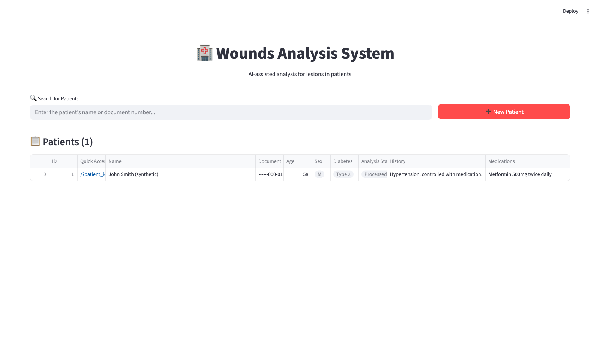
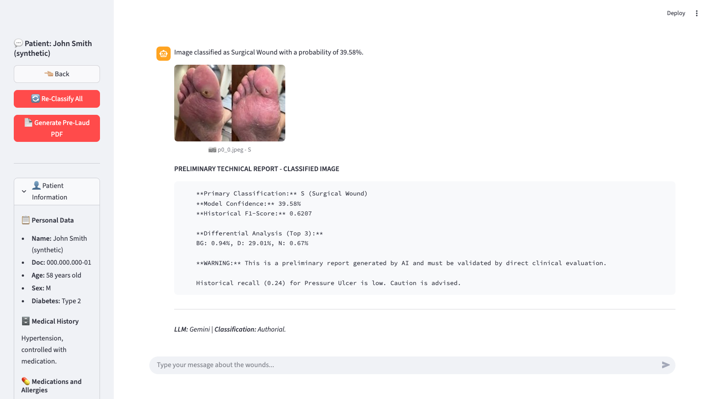

# AI-Enabled Digital Healthcare Workflow for Interpretable Wound Triage

> **Paper submitted to [CBEB 2026](https://sbeb.org.br/cbeb2026/), the Brazilian Congress on Biomedical Engineering**
> *An AI-Enabled Digital Healthcare Workflow: Integrating Deep Learning and Large Language Models for Interpretable Wound Triage*
> Ernane Ferreira Rocha Junior (UFRN), Ignacio Sanchez-Gendriz (CETENE/MCTI), Luiz Affonso Guedes (UFRN)

Research code accompanying the paper above. An AI-enabled clinical decision support system (AI-CDSS) for chronic wound triage, combining computer vision with a large language model to classify skin lesions and generate clinical pre-reports labeled for clinician verification.

1. **Classification.** A VGG16 backbone, trained in two stages (transfer learning, then fine-tuning of block5), classifies wound images into six classes from visual data alone.
2. **Narrative interpretability.** Gemini receives the predicted class, the full probability vector, and the model's documented per-class precision, recall, and F1-score, and produces a short natural-language pre-report.
3. **Human review.** Every pre-report is explicitly labeled as a preliminary, AI-generated draft that must be independently verified by a clinician before any use in patient care; the prototype does not implement a software approval gate.

The system runs as an asynchronous, containerized pipeline: a Streamlit interface, a Celery worker for classification and PDF generation, PostgreSQL for relational storage, and Redis as the task broker. It originated as a project for the UFRN graduate course PPGEEC2328 (Special Topics in Embedded and Distributed Processing).

---

## Requirements

- Docker and Docker Compose
- `GEMINI_API_KEY` for pre-report generation (get one at [Google AI Studio](https://aistudio.google.com/apikey))
- The trained classifier checkpoint `best_wound_classifier_FINETUNED.h5`, placed manually under `backend/models/` (not versioned; see [Notes](#notes))

---

## Quick start

```bash
# 1. Environment variables
cp .env.example .env
# fill in POSTGRES_DB, POSTGRES_USER, POSTGRES_PASSWORD, GEMINI_API_KEY

# 2. Model checkpoint
# place best_wound_classifier_FINETUNED.h5 under backend/models/

# 3. Start all services
docker compose up --build
```

Open **http://localhost:8501**.

`docker compose` starts four services: `postgres`, `redis`, `streamlit` (web interface), and `worker` (Celery, consumes classification and report-generation tasks). The `backend/` package is mounted as a shared volume into both `streamlit` and `worker`.

---

## Model training

Training is documented in `lesion_classifier.ipynb`, run on GPU (Google Colab) against the public dataset referenced in [Notes](#notes). Two stages:

- **Transfer learning:** VGG16 base frozen, custom head trained with Adam (lr = 1e-4), Early Stopping and checkpointing on validation loss/accuracy.
- **Fine-tuning:** `block5` unfrozen, trained with a lower learning rate (lr = 1e-5) and Early Stopping (patience = 5).

Both stages monitor metrics on the 234-image test partition, since the original protocol does not carve out a separate internal validation split; this is documented as a methodological limitation in the paper (Section III-B).

---

## Key results

Evaluated on the held-out test partition (n = 234 images), reproduced from the released `FINETUNED` checkpoint:

| Stage | Epochs | Accuracy | Venous (V) recall |
|---|:---:|:---:|:---:|
| Initial transfer learning | 50 | 72.22% | 87.09% |
| Extended transfer learning | 94 | 74.79% | 87.09% |
| Fine-tuning (block5) | 13 (+94) | 74.79% | 91.94% |

The fine-tuned model reaches 74.79% global accuracy (Wilson 95% CI [68.9%, 79.9%]), with class V (venous ulcer) recall at 91.94%. Class P (pressure ulcer) recall remains the system's main limitation at 23.53%, frequently confused with other lesion types; this figure is surfaced to clinicians as a permanent, always-visible disclosure in every generated pre-report rather than hidden behind the global accuracy number.

[Example pre-report (PDF)](./assets/exemplo-pre_laudo.pdf)

The calibration analysis reported in the paper (ECE, reliability diagram, Wilson 95% CI) is reproducible via `scripts/calibration_analysis.py`, run against the same checkpoint and test partition.

---

## Additional experiment

`exp-realtime/` contains a standalone Streamlit app for real-time webcam classification using the same model. It is not part of the `docker compose` stack described above and is not covered in the paper.

---

## Screenshots

|||
|-|-|
|||
|Dashboard: patient listing, history, and processing status|Chat interface for reviewing and discussing a generated pre-report|

The patient names, images, and clinical text shown in these screenshots are synthetic demo data, not real patients.

---

## Citation

This repository accompanies a paper submitted to CBEB 2026. If you use this code, please cite:

```bibtex
@inproceedings{rocha2026wound,
  author    = {Rocha Junior, Ernane Ferreira and S{\'a}nchez-Gendriz, Ignacio and Guedes, Luiz Affonso},
  title     = {An {AI}-Enabled Digital Healthcare Workflow: Integrating Deep Learning and
               Large Language Models for Interpretable Wound Triage},
  booktitle = {Proceedings of the Brazilian Congress on Biomedical Engineering (CBEB)},
  year      = {2026}
}
```

---

## Notes

- Training and test data are drawn from the public "Multi-modal wound classification using images and locations" dataset, collected at the AZH Wound and Vascular Center (Anisuzzaman et al., 2022; Patel et al., 2024): [github.com/uwm-bigdata/wound-classification-using-images-and-locations](https://github.com/uwm-bigdata/wound-classification-using-images-and-locations). The dataset is public and pre-anonymized.
- The deployed system persists real patient identifiers, clinical history, and images, unlike the pre-anonymized training dataset, and therefore falls under Brazil's LGPD. The current proof of concept does not yet implement encryption at rest, authentication, or an anonymization pipeline; hardening the platform to LGPD requirements is a prerequisite for any use beyond controlled evaluation.
- `backend/models/` is git-ignored (large binary weights). You must obtain `best_wound_classifier_FINETUNED.h5` separately before starting the stack.
- The LLM component uses Google's `gemini-3.6-flash` with default generation parameters (no explicit temperature or top-p override).

---

## License

The code in this repository is released under the [MIT License](LICENSE). This does not extend to the paper text in `article/` (all rights reserved by the authors) or to the wound dataset referenced above, which retains its original license terms.
